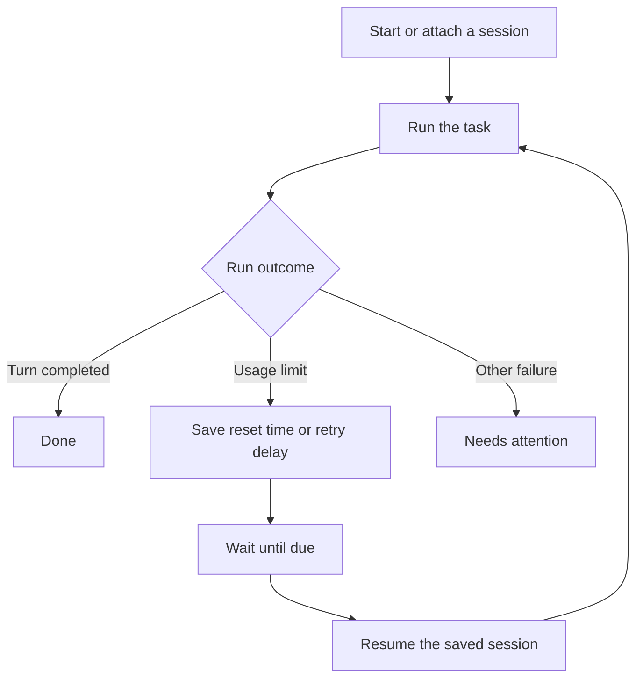

<div align="center">

# Reset Runner

**Let your coding agent pick up where it left off.**

A lightweight background tool that resumes Codex and Claude Code sessions after usage limits reset.

Python 3.10+ · Zero third-party dependencies · Local execution

[Quick start](#quick-start) · [How it works](#how-it-works) · [Commands](#command-reference) · [Compatibility](#compatibility) · [Troubleshooting](#troubleshooting)

</div>

---

When a coding agent hits its usage limit, the work stops. Reset Runner saves the session, waits for the allowance to reset, and sends a continuation instruction to that same conversation.

It runs independently of the AI client, so the timer keeps working even when the agent cannot make another tool call. Use your existing CLI installation and sign-in—no separate service account or API key is required by Reset Runner.

> [!NOTE]
> Reset Runner manages tasks you launch through it or explicitly attach by session ID. It does not automatically monitor every desktop or browser chat.

## Features

- **Automatic continuation** — Resume the saved session after a usage-limit interruption.
- **Reset-aware scheduling** — Target three seconds after the provider's reported reset time.
- **Persistent queue** — Keep queued and waiting jobs across worker restarts.
- **Background operation** — Close the terminal while the worker stays running.
- **Simple controls** — Inspect status and logs, cancel jobs, or retry a job after review.
- **Optional login startup** — Register a macOS LaunchAgent or Windows Scheduled Task.

## Quick start

### 1. Check the prerequisites

You need **Python 3.10 or newer** and at least one supported client—**Codex CLI** or **Claude Code**—installed and signed in. Use a project directory you trust.

Download or clone this repository, open a terminal in its root folder, and check your setup:

```sh
python3 reset_runner.py doctor
```

### 2. Start a task

**Codex**

```sh
python3 reset_runner.py run codex \
  --cwd "/absolute/path/to/project" \
  "Implement the task and run the relevant checks"
```

**Claude Code**

```sh
python3 reset_runner.py run claude \
  --cwd "/absolute/path/to/project" \
  "Implement the task and run the relevant checks"
```

Replace the project path and prompt with your own. The command saves the job, starts the background worker, and prints a **job ID**. Keep that ID to inspect or cancel the task.

### 3. Check progress

```sh
python3 reset_runner.py status
python3 reset_runner.py logs JOB_ID
```

You can now close the terminal. The worker runs one task at a time; a waiting task leaves the worker free to run another ready job.

<details>
<summary><strong>Windows and macOS shortcuts</strong></summary>

On Windows, replace `python3` with `py -3`, or use the included launcher. Enter commands on one line:

```powershell
.\reset-runner.cmd doctor
.\reset-runner.cmd run claude --cwd "C:\Projects\my-project" "Implement the task and run the relevant checks"
```

Provider clients must resolve to native executables. Windows `.cmd` and `.bat` provider shims are rejected; use a native installation or run both Reset Runner and the provider inside WSL.

On macOS, double-click **`Start.command`** to check the installed clients and start an idle worker. This shortcut does not register a task or enable login startup.

</details>

## Resume an existing session

Stop any other runner for the session, then attach its exact session UUID:

```sh
python3 reset_runner.py attach codex SESSION_UUID \
  --cwd "/absolute/path/to/project"
```

Use `claude` in place of `codex` for a Claude Code session. The conversation must be saved locally and resumable by that provider's CLI.

Attaching sends a continuation instruction immediately. If the provider still rejects it for a usage limit, Reset Runner records the reset and waits. If you already know when to resume, set a start time:

```sh
python3 reset_runner.py attach claude SESSION_UUID \
  --cwd "/absolute/path/to/project" \
  --at "2027-01-15T09:00:03-05:00"
```

Replace the example date with your intended future time. Include a timezone offset or `Z`.

### Job options

These options apply to both `run` and `attach`.

| Option | Purpose | Default |
| --- | --- | --- |
| `--cwd PATH` | Trusted project directory | Required |
| `--at TIMESTAMP` | Earliest start time, in ISO 8601 with a timezone | Immediately |
| `--model NAME` | Select a model for this job | Provider's configured default |
| `--max-attempts N` | Cap total execution attempts, including the first | `100` |

## How it works



Reset Runner captures structured client events and saves the exact session ID as soon as it is available. Claude reports limit information through `rate_limit_event`; Codex also exposes a read-only `account/rateLimits/read` query through its local app-server.

For Codex's `codex` meter, the worker waits for **all exhausted primary and secondary windows** to reset. Unrelated meters do not delay the task.

When a reset timestamp is available, the target dispatch time is **reset + 3 seconds**. An idle worker checks for due jobs every half second. Continuation instructions ask the agent to inspect existing work before repeating actions.

> [!IMPORTANT]
> Same-minute resumption requires a usable provider timestamp, an awake and connected computer, and a free worker. If the timestamp is unavailable, status labels the fallback: retries after 60, 120, 240, 480, then 900 seconds between attempts. Timing is a target, not a real-time guarantee.

After sleep, overdue jobs become eligible when the worker wakes. If the worker crashes during execution, that job moves to `attention` on restart so potentially completed actions are not silently replayed. Inspect the session and stop any surviving provider process before retrying.

## Command reference

Run each command as `python3 reset_runner.py COMMAND`.

| Command | What it does |
| --- | --- |
| `run PROVIDER ...` | Register and start a new task |
| `attach PROVIDER SESSION_UUID ...` | Continue a specific saved session |
| `doctor` | Check Python, installed clients, and worker status |
| `status` | Show job states, due times, attempts, and session IDs |
| `logs JOB_ID` | Print the last 80 output records for a job |
| `cancel JOB_ID` | Cancel a waiting job or terminate a running job |
| `stop` | Stop the worker and preserve queued or waiting jobs |
| `start` | Start the worker and process eligible saved jobs |
| `retry JOB_ID` | Retry an `attention` job after review; reset its attempt counter |
| `limits` | Read Codex account limits without running a model or consuming reset credits |

### Job states

| State | Meaning |
| --- | --- |
| `queued` | Saved and waiting for its start time or a free worker |
| `running` | The provider client is executing the task |
| `waiting` | A usage limit was detected; a retry is scheduled |
| `done` | The provider successfully completed its turn |
| `attention` | Review is needed before another attempt |
| `cancelled` | The job was cancelled and will not run again |

A completed turn does not independently verify that the entire project is finished. Authentication failures, denied permissions, missing session IDs, retry caps, and interrupted execution can require attention; generic failures are not automatically retried.

## Start automatically after login

Place the repository folder in its permanent location, then install the startup entry:

```sh
python3 autostart.py install
```

This registers a per-user **LaunchAgent on macOS** or **Scheduled Task on Windows**. No administrator account is requested. Installation stops the current worker, so set it up before starting a task.

To remove login startup:

```sh
python3 autostart.py remove
```

Startup registration is optional and is not enabled by opening the folder or running a task. It starts the worker after login; it does not wake a sleeping or powered-off computer.

## Compatibility

| Environment | Status |
| --- | --- |
| macOS | Worker and live Codex execution/resumption verified |
| Windows | Portable implementation and startup helper included; runtime not yet tested |
| Linux / WSL | Portable implementation; use your own service manager for startup; runtime not yet tested |
| iOS | No background worker included |
| Codex CLI | Live task, explicit-session resume, and account-limit query verified |
| Claude Code | Simulated limit/resume flow verified; live execution was blocked by the test account's organization access policy |

Actual account exhaustion was not induced during testing. See [verification results](VERIFICATION.md) for tested versions, coverage, and limitations.

## Troubleshooting

Start with `doctor`, then inspect `status` and the affected job's logs.

| Symptom | What to check |
| --- | --- |
| Client not found | Make sure its executable is installed and available on `PATH`; run `doctor` again from the same terminal. |
| Job needs attention | Read `logs JOB_ID`, resolve the reported issue, then use `retry JOB_ID`. |
| Sign-in or organization access error | Restore access in the provider client first. A timer cannot resolve an account restriction. |
| Reset time unavailable | The worker is using the displayed retry delay. Exact timing requires a usable provider timestamp. |
| Due time passed but the job has not started | Check whether the computer was asleep, the worker is stopped, or another job is running. |
| Worker will not start | Inspect `.reset-runner/daemon.log` and check for an existing worker using the same data directory. |
| Session cannot be resumed | Confirm the exact UUID and project directory, and that the conversation is saved locally for the selected client. |

## Permissions and local data

Reset Runner uses the provider clients' existing authentication and configuration. It does not extract OAuth tokens, switch accounts, purchase credits, consume reset credits, or bypass usage limits.

- **Codex** runs in the `workspace-write` sandbox without approval prompts. Actions requiring broader approval cannot proceed.
- **Claude Code** uses its existing permission configuration. Authorize the tools your task needs in Claude Code beforehand.
- **Project configuration** still applies, including client hooks and MCP servers. Use trusted project directories. Existing API keys and billing settings remain the client's responsibility.

State is stored in `.reset-runner/` next to the script:

```text
.reset-runner/
├── queue.sqlite3   # Jobs, prompts, session IDs, and scheduling state
├── daemon.lock    # Worker ownership lock
├── daemon.log     # Background worker output
└── logs/          # Per-job raw client output
```

The included `.gitignore` excludes runtime state from Git. Keep this directory private: prompts and logs may contain sensitive information. Logs are not automatically rotated or deleted.

To choose a different state directory, put the global `--data` option **before** the command and use the same path on subsequent calls:

```sh
python3 reset_runner.py --data "/absolute/path/to/runner-state" status
```

The login startup helper uses the default state directory.

One worker is enforced per data directory, and duplicate active session IDs are rejected within that database. Separate data directories and other applications are outside that protection.

<details>
<summary><strong>Additional scope limits</strong></summary>

- Sessions must be launched through Reset Runner or explicitly attached. Arbitrary desktop chats, browser conversations, cloud tasks, and account-wide monitoring are outside this version's scope.
- Codex's account-limit adapter selects the `codex` meter. Custom or model-specific meters may rely on error reset data or bounded retries.
- Time-only messages such as “resets 5pm” are not guessed across timezones.
- An MCP server is not required. The independent worker owns the timer even when the AI host cannot make another call.

</details>

## Development

Run the test suite from the repository root:

```sh
python3 -m unittest discover -s tests -v
```

The suite includes real simulator subprocesses for both clients and covers limit detection, persistent waits, worker restarts, exact-session resumption, scheduling, cancellation, duplicate protection, and crash recovery. Test fixtures do not call AI models.

- [Design and research](PLAN.md)
- [Verification results](VERIFICATION.md)

## Uninstall

Remove login startup if installed, then stop the worker:

```sh
python3 autostart.py remove
python3 reset_runner.py stop
```

Save any logs you want to keep, then delete the repository folder.
# reset-runner
